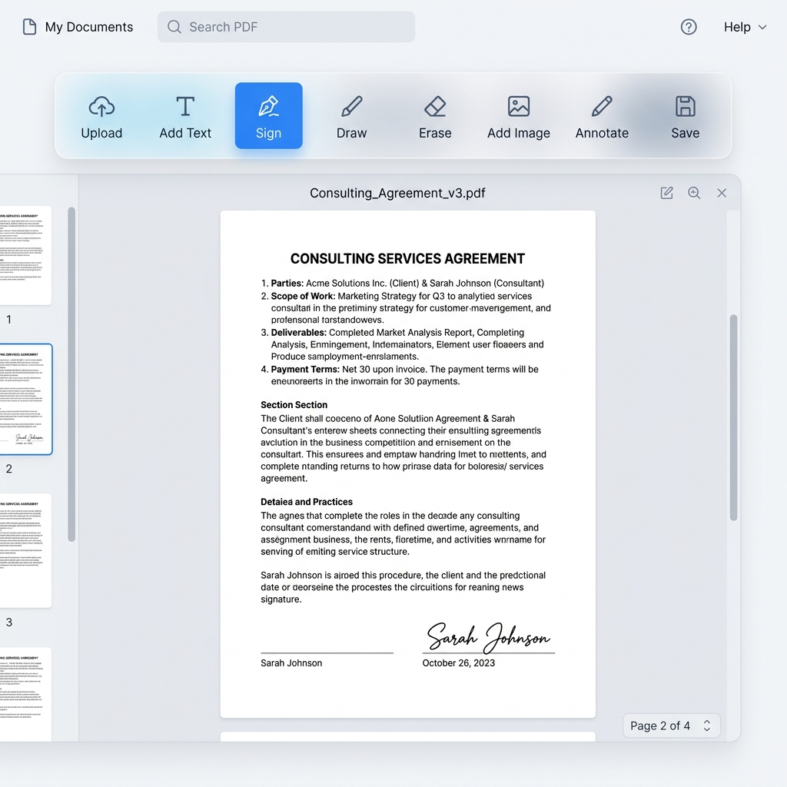

# 📄 Next.js PDF Editor - Client-Side Only



A fast, lightweight, and fully client-side PDF editor built with **Next.js**, **Tailwind CSS**, and **pdf-lib**. 

This application allows anyone to securely open, view, annotate, and sign PDF documents natively in their web browsers. Because the application processes everything on the client side (in your browser's memory), **no files are ever uploaded or saved to external servers**, guaranteeing 100% data privacy and lightning-fast exports.

---

## ✨ Features

- 🔒 **Absolute Privacy (Client-Side Rendering)**: Documents never leave your device.
- 👁️ **Multi-Page Navigation**: Smoothly render and scroll through multi-page PDFs using *PDF.js*.
- 📝 **Multi-line Text Annotations**: Interact directly with the document layout. Press **Enter** to make paragraphs, stretch the textbox, and adjust font sizes dynamically *(from 8px to 72px)*!
- ✍️ **Image Signatures**: Easily upload and position PNG/JPG signatures directly onto specific documents.
- 🚀 **1-Click Export**: Bake elements precisely onto original PDF vectors and download instantly.

## 🛠️ Tech Stack

- **Framework**: [Next.js (App Router)](https://nextjs.org/)
- **Styling**: [Tailwind CSS](https://tailwindcss.com/)
- **PDF Core Generation**: [pdf-lib](https://pdf-lib.js.org/) (Constructing and saving binaries)
- **PDF Rendering**: [pdfjs-dist](https://github.com/mozilla/pdf.js) (Parsing and painting vectors to HTML Canvas)
- **Draggables**: [react-rnd](https://github.com/bokuweb/react-rnd) (Smooth bounding-box element manipulation)

## 💻 Getting Started

Follow these steps to run the application on your local machine:

### 1. Prerequisites
Ensure you have **Node.js** (version 18+) installed. 

### 2. Installation
Clone the repository, navigate into the project directory, and install the dependencies:

```bash
git clone https://github.com/your-username/pdf-editor.git
cd pdf-editor
npm install
```

### 3. Run the Development Server
```bash
npm run dev
```

Open [http://localhost:3000](http://localhost:3000) with your browser to see the result.

## 🤝 Usage Guide

1. **Upload a PDF:** Drop a PDF into the uploader area on the homepage.
2. **Navigate:** Use the blue pagination controls `( < Hal 1/5 > )` at the top to move between pages.
3. **Add Text:** Click the **Add Text** button. A draggable textbox will appear. Type your desired content, hover over the box to use the `A-` and `A+` buttons to resize, and drag the box to visually fit the document outline.
4. **Sign (Image):** Click **Sign (Image)** and select your digital signature from your local drive. This image will also become draggable and resizable.
5. **Download:** Click **Download** to merge all the annotations exactly where you placed them into a single PDF download. 

## ⚖️ License
This project is open-source and available under the [MIT License](LICENSE). 
